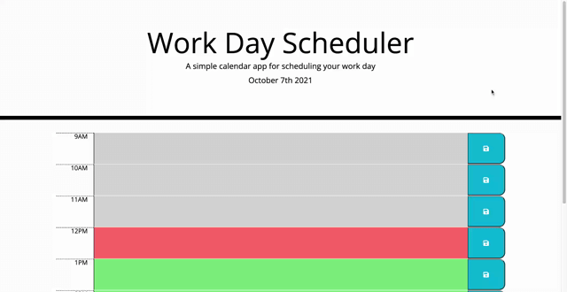

# day-planner

This is a day planner for scheduling events. You can type in information into one of the time blocks and that data will persist after reloading the page. It also tells you what time it is and if time blocks are in the past, present or future.

Here is [link](https://seanscraig.github.io/day-planner/) to the live webpage

# Instructions

1) Scoll to see the current timeblock and future timeblocks

2) Click on one of them to enter an event

3) Click the button with a floppy disk image to save the event

## Installation

Use git clone to clone the repository on your local machine and then open in a web browser.

## Contributing
Pull requests are welcome. For major changes, please open an issue first to discuss what you would like to change.
